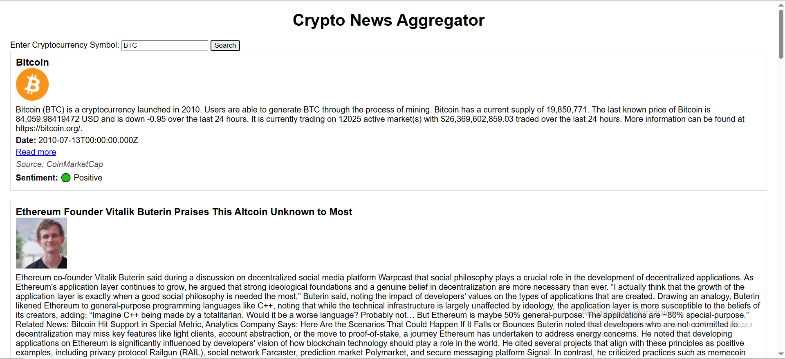
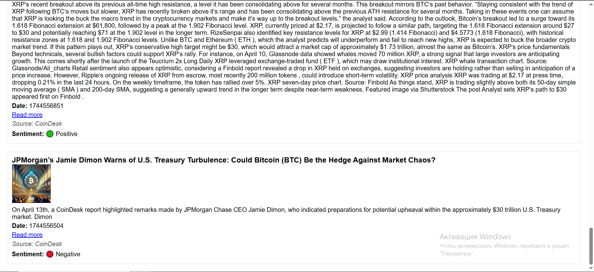

# 📰 Crypto News Aggregator with Sentiment Analysis

A web service built with **Rust (Actix Web)** that aggregates cryptocurrency news from **CoinMarketCap** and **CoinDesk**, analyzes sentiment using **vader_sentiment**, and displays results in a simple UI with 🟢 Positive, 🟡 Neutral, 🔴 Negative tags.

---

## 🚀 Usage

1. **Clone the repo:**
   ```bash
   git clone https://github.com/AbylaiSekerbek7/Assignment_1.4_Blockchain.git
   cd simple_crypto

2. **Set up .env: Create a .env file with your CoinMarketCap API key:**
COINMARKETCAP_API_KEY=your_api_key_here

3. **Run the server:**
    ```bash
    cargo run

4. **Open in browser:**
http://localhost:8080/index.html

# DEMO



# 📦 Examples
You can search for any popular crypto symbol:

/news?symbol=BTC

/news?symbol=ETH

/news?symbol=SOL

The result will contain:

✅ Title and description

✅ Date and source

✅ Link to article

✅ Sentiment status (🟢/🟡/🔴)

✅ Logo or image (if available)

## 🛠 Tech Stack
Rust

Actix Web

Reqwest

Serde / JSON

vader_sentiment

HTML + CSS (UI)

# 📄 License
MIT © 2025 Abylaikhan Sekerbek